# NXP NavQ95 Vehicle Computer

Welcome to the documentation for the NavQ95, a vehicle computer reference design designed around the NXP i.MX95 developed by NXP Mobile Robotics. Please note that this board is currently a Proof of Concept only and is considered not supported by NXP.

The NavQ95 features a single main board with a small form factor and is designed to merge a Vehicle Management Unit and a Vehicle Companion Computer into one unified, heterogeneous MCU/MPU device.

> [!TIP]
> See [MR-NAVQ95/Mr Solutions MR-MR-NAVQ95-RevB description slides (Public).pdf](<https://github.com/NXP-Robotics/MR-NAVQ95/blob/main/Mr Solutions MR-NavQ95-RevB description slides (Public).pdf>) also for a short overview presentation.

MR-NavQ95 Top view     |  MR-NavQ95 Side View
:-------------------------:|:-------------------------:
  |  

# Core Architecture & AI

The heterogeneous vehicle computer is powered by the [NXP i.MX 95](https://www.nxp.com/products/i.MX95) processor and is divided into specific execution domains:
- **Compute**: 6x Arm Cortex-A55 cores dedicated to executing compute-intense functions.
- **Real-Time Control**: 1x Arm Cortex-M7 core to execute real-time control tasks.
- **System Management**: 1x Arm Cortex-M33 core to execute the NXP System Manager.

## AI Capabilities:

- Equipped with an on-chip NXP Neutron NPU.
- High-bandwidth M.2 PCIe interfaces target up to 2 [NXP Kinara Ara240 NPUs](https://www.nxp.com/products/ARA240).
- Supports cloud-based AI via Wifi6 or 5G connectivity

## Software Stack:

The board is designed to run open-source software, leveraging its multi-core architecture:

- Cortex-A55 Cores: Runs the Ubuntu PoC image 24.04 with ROS2 Jazzy.
> [!NOTE]
> This is an open Proof of Concept (POC) design and is not officially supported by NXP.
> The design is enabled with a Vanilla Ubuntu POC layered on top of existing NXP Yocto build.
> This means ROS2 main installs via `apt install ros2`.
>
> The unsupported software repo can be found here: https://github.com/NXP-Robotics/imx-manifest-navq95
- Cortex-M7 Core: Runs either Zephyr / CogniPilot or NuttX / PX4.
- Communication: High-speed inter-core communication is facilitated using shared memory / OpenAMP RpMsg.

### Cortex-M7 realtime software
A range of software platforms can be deployed on the Cortex-M7 core. The following software platforms have been prepared for use with the MR‑NAVQ95:
- Zephyr
  - https://www.zephyrproject.org/
  - https://github.com/CogniPilot/zephyr_boards/
- CogniPilot Cerebri (Zephyr based)
  - https://CogniPilot.org/
- NuttX
  - https://NuttX.apache.org/
  - https://NuttX.apache.org/docs/latest/platforms/arm/imx9/boards/mr-navq95b/index.html
- PX4 Autopilot (NuttX based)
  - https://px4.io/

## Hardware Specifications

### Power and Memory
* **Input Power:** Supports an operating voltage range of 9V to 52V, with a maximum limit of 60V. This easily accommodates 3S to 12S battery configurations, delivering 60W across the 9-20V (3-7S) range, and stepping up to 125W for the 20-52V (8-12S) range.
* **RAM:** Up to 16 GB of LPDDR5 memory.
* **Storage Options:** 64 GB onboard eMMC, an Octal-SPI Flash module, a Micro SD card reader, and PCIe M.2 support for solid-state drives.

### Connectivity
* **Standard Ethernet:** One Gigabit RJ45 port supporting Precision Time Protocol (PTP).
* **Automotive Ethernet:** Both 100BASE-T1 and 1000BASE-T1 ports, also featuring PTP.
> [!TIP]
> 100(0)BASE-T1 is Ethernet over single unshielded twisted pair
* **Wireless Comms:** Powered by the NXP IW612 chip for Wi-Fi, Bluetooth, and Matter support.
* **Cellular Data:** Includes a SIM slot and an M.2 PCIe interface meant for a cellular modem.

### Onboard Mobile Robotics Sensors
* TDK ICM-45686 Inertial Measurement Unit (IMU)
* Bosch BMM350 Magnetometer
* Bosch BMP581 Barometer

### Physical Interfaces
* USB 2.0 and 3.0 ports.
* Two PCIe M.2 slots (Type M and Type B).
* A 10-pin JTAG SWD debugging header.

## Main Board Schematics

The MR-NAVQ95 Main Board serves as the central processing and power distribution hub for the platform. It handles the core i.MX95 compute, wide-input power delivery, and routing to all board-to-board and high-speed interfaces. 

For detailed component layouts, pin configurations, and electrical routing, refer to the core system schematics:
* [NAVQ95-MAIN](Schematic/SPF-97010_A1-MAIN.pdf)

## Expansion Capabilities

Building upon this core Main Board, the system is highly adaptable thanks to support for modular add-on boards:

**XGMII-based Networking expansion boards:** 
* [NAVQ95-T1SW](Schematic/SPF-97011_A1-T1SW.pdf): T1 Switch utilizing the NXP SJA1110 for six 100BASE-T1 connections and 2x 1000BASE-T1.
* [X-MR-NAVQ95E-T1P](Schematic/Prototypes/Schematic-Rev-A/SPF-96098_A-T1PHY.pdf): T1 Single Phy setup using the NXP TJA1103.

**CSI/DSI Vision / Camera expansion board:** 
* [NAVQ95-CAMRP](Schematic/SPF-97012_A1-CAMRP.pdf): A 22-pin Raspberry Pi-style connector expansion board for CSI/DSI interfaces.

**General purpose I/O expansion board:**
* [NAVQ95-IO](Schematic/SPF-97013_A1-IO.pdf): Drone & Rover IO: Uses standard Dronecode connectors for extensive peripheral support:
    * 3x CAN-FD
    * Bosch BMI088 IMU
    * 8x FlexIO/PWM output
    * Dronecode JST-GH 10-pin GPS connector
    * Dronecode JST-GH 6-pin Telemetry connector
    * Dronecode JST-GH 4-pin I2C connector
    * WM8962B Audio codec with:
        * Audio jack
        * 2x PDM Microphones
        * 2x 1W stereo output
    * 2x UART to USB-C for Serial Console

## MR-NAVQ95 hardware connector reference

Each card shows three things per pin: the **function**, the **net name in the schematic** and the
**i.MX95 pad** the signal ends up on. Parts in between, such as transceivers, level shifters and
I/O expanders, are shown too. Pin 1 is the square pad.

## Board overview

<!-- overview:top -->
<picture>
  <source media="(prefers-color-scheme: dark)" srcset="images/overview-top-dark.svg">
  
</picture>
<!-- /overview -->

<!-- overview-list:top -->
Not visible here: [J13 USB1](#main-other-connectors) (bottom view) · [J12 USB2](#main-other-connectors) (bottom view) · [J16 M.2 KEY B](#main-j16-m2-key-b) (bottom and front view) · [J7 DEBUG](#main-j7-debug) (front view) · [J6 MICROSD](#main-other-connectors) (front view) · [J11 RTC_BAT](#main-j11-rtc_bat) (not visible in the photos) · [SW2 BTMODE](#buttons-and-switches) (top side, under the M.2 Key M module)
<!-- /overview-list -->

> [!NOTE]
> The boot-mode switch (SW2) is explained in the
> [imx-manifest-navq95 README](https://github.com/NXP-Robotics/imx-manifest-navq95#power-up-navq95).

Front view. The JST-GH connectors of the IO board are on top. Below them, on the edge of the
main board, are the debug header, the microSD slot, the SIM holder and the M.2 Key B slot:

<!-- overview:side -->
<picture>
  <source media="(prefers-color-scheme: dark)" srcset="images/overview-side-dark.svg">
  
</picture>
<!-- /overview -->

Bottom side. In this photo the T1 Ethernet switch board and two camera boards are fitted. The
left camera board is on the CSI_B2B port, the right one on the DSICSI_B2B port; only the
DSICSI_B2B port can also drive an RPi DSI display. PORT1 to PORT10 are the switch ports:

<!-- overview:bottom -->
<picture>
  <source media="(prefers-color-scheme: dark)" srcset="images/overview-bottom-dark.svg">
  
</picture>
<!-- /overview -->

<!-- overview-list:bottom -->

<!-- /overview-list -->

## Connector index

<!-- index -->
| Ref | Function | Connector | Details |
|---|---|---|---|
| [Main J1](#main-j1-m2-key-m) M.2 KEY M | M.2 Key M slot, PCIe x1 (NPU or NVMe SSD) | M.2 Socket 3 Key M, 2242 / 2280 standoffs, 3.3 V up to 3.5 A |  |
| [Main J2](#main-j2-console) CONSOLE | UART1 (Linux console) and UART2 (M7 console) header, DS-009 TELEM layout | JST-GH 1x6 (SM06B-GHS-TB) |  |
| [Main J3](#main-other-connectors) B2B | Board-to-board expansion headers | Board-to-board headers | J3/J4 B2B_IO1/IO2 (2x25) for the IO board, J14/J15 B2B_CSI/DSICSI (2x20) for the camera boards, J17 B2B_ETH (2x25) for the T1 boards. Pin lists are on schematic page 25. |
| [Main J5](#main-j5-sim) SIM | SIM card holder for the Key B modem slot | SIM card holder, 6 contacts + card-detect switch, bottom side |  |
| [Main J6](#main-other-connectors) MICROSD | microSD card slot (USDHC2) | microSD push-push, bottom side | USDHC2. The board can boot from it when the boot-mode switch selects SD. |
| [Main J7](#main-j7-debug) DEBUG | SWD / JTAG debug header (Arm Cortex 10-pin) | 2x5 1.27 mm (Samtec SHF-105-01-L-D-RA) |  |
| [Main J8](#main-other-connectors) ENET1 | Gigabit Ethernet with PTP | RJ45 with magnetics (Abracon ARJM11D7) | RTL8211 PHY on i.MX95 ENET1, supports IEEE 1588 PTP. |
| [Main J9](#main-j9-pwr_in) PWR_IN | Power input 9-52 V (3S-12S battery) | Molex Micro-Fit 3.0 2-pin (0430450222) |  |
| [Main J11](#main-j11-rtc_bat) RTC_BAT | RTC backup battery (rechargeable ML2020, RPi 5 compatible) | JST-SH 1.0 mm 2-pin (SM02B-SRSS-TB), top entry |  |
| [Main J12](#main-other-connectors) USB2 | USB 2.0 Type-C host port | USB Type-C receptacle, bottom side | Host port. 5 V VBUS through an NX20P0477 load switch with over-current protection. |
| [Main J13](#main-other-connectors) USB1 | USB 3.0 Type-C, serial download / device port | USB Type-C receptacle, bottom side | Serial-download port of the i.MX95 boot ROM and the port the NavQ95 flasher uses. USB 3.0 and USB 2.0 are both connected. |
| [Main J16](#main-j16-m2-key-b) M.2 KEY B | M.2 Key B slot, PCIe x1 with SIM (cellular modem) | M.2 Socket 2 Key B / B+M, 2242 / 3042 / 3052 standoffs, bottom side, 3.3 V up to 5 A |  |
| [Main J18](#main-other-connectors) ANT0/ANT1 | Wi-Fi 6 / Bluetooth antennas (IW612), ANT0 = J18, ANT1 = J19 | 2x U.FL | ANT0 = J18, ANT1 = J19. IW612 Wi-Fi 6, Bluetooth and 802.15.4. |
| [IO J1](#io-j1-console) CONSOLE | USB-C console: CP2105 bridge, UART1 = Linux, UART2 = M7 | USB Type-C receptacle (USB 2.0 device) |  |
| [IO J2](#io-j2-spkr) SPKR | Stereo speaker output (WM8962B class-D, 2x 1 W) | JST-PH 2.0 mm 1x4 |  |
| [IO J3](#io-j3-can3) CAN3 | CAN FD 3 (TJA1463) | JST-GH 1x4, side entry |  |
| [IO J4](#io-j4-can2) CAN2 | CAN FD 2 (TJA1463) | JST-GH 1x4, side entry |  |
| [IO J5](#io-j5-can1) CAN1 | CAN FD 1 (TJA1463) | JST-GH 1x4, side entry |  |
| [IO J6](#io-j6-telem) TELEM | Telemetry UART7 with flow control | JST-GH 1x6, top entry |  |
| [IO J7](#io-j7-i2c) I2C | I2C6 peripheral connector | JST-GH 1x4, top entry |  |
| [IO J8](#io-j8-gps) GPS | GPS: UART5, I2C6, safety switch, LED, buzzer | JST-GH 1x10, side entry |  |
| [IO J9](#io-j9-pwm) PWM | 8x PWM / timer outputs (TPM3 to TPM6), also usable as FlexIO1 pins | JST-GH 1x10, side entry |  |
| [IO J12](#io-j12-audio) AUDIO | 3.5 mm headset jack, CTIA wiring (WM8962B headphone out + microphone in) | 3.5 mm 4-pole TRRS jack with insertion switch, board underside |  |
| [CAM J3](#cam-j3-csi) CSI | MIPI CSI-2 camera, 4 data lanes, RPi camera compatible | 22-pin 0.5 mm FPC/FFC, contacts away from the PCB |  |
| [CAM J4](#cam-j4-5v) 5V | 5 V header for a display (not fitted) | 1x3 2.54 mm right-angle header, not fitted |  |
| [T1S J2](#t1s-ports-and-headers) DEBUG | Debug header of the SJA1110 (Arm Cortex-M7 inside the switch) | 2x5 1.27 mm | Not the i.MX95 debug port; that is J7 on the main board. |
| [T1S J3](#t1s-ports-and-headers) PORT2 | 1000BASE-T1 port 2 | Single-pair automotive connector | TJA1120 PHY on SJA1110 SGMII port 2. |
| [T1S J4](#t1s-ports-and-headers) PORT1 | 1000BASE-T1 port 1 | Single-pair automotive connector | TJA1120 PHY on SJA1110 SGMII port 1. |
| [T1S J5](#t1s-ports-and-headers) PORT5 | 100BASE-T1 port 5 | 2-pin single-pair connector | SJA1110 internal 100BASE-T1 PHY, switch port 5. |
| [T1S J6](#t1s-ports-and-headers) PORT6 | 100BASE-T1 port 6 | 2-pin single-pair connector | SJA1110 internal 100BASE-T1 PHY, switch port 6. |
| [T1S J7](#t1s-ports-and-headers) PORT7 | 100BASE-T1 port 7 | 2-pin single-pair connector | SJA1110 internal 100BASE-T1 PHY, switch port 7. |
| [T1S J8](#t1s-ports-and-headers) PORT8 | 100BASE-T1 port 8 | 2-pin single-pair connector | SJA1110 internal 100BASE-T1 PHY, switch port 8. |
| [T1S J9](#t1s-ports-and-headers) PORT9 | 100BASE-T1 port 9 | 2-pin single-pair connector | SJA1110 internal 100BASE-T1 PHY, switch port 9. |
| [T1S J10](#t1s-ports-and-headers) PORT10 | 100BASE-T1 port 10 | 2-pin single-pair connector | SJA1110 internal 100BASE-T1 PHY, switch port 10. |
<!-- /index -->

## Main board

<!-- heading:main/J9 -->
### Main J9 PWR_IN
<!-- /heading -->

<!-- pinout:main/J9 -->
<picture>
  <source media="(prefers-color-scheme: dark)" srcset="images/main-J9-dark.svg">
  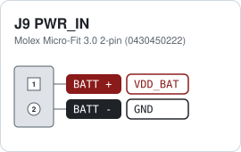
</picture>

Pin 1 (BATT +) is the lower pin on the board. Input 9 to 52 V, never more than 60 V. The board can draw 60 W between 9 and 20 V, and 125 W between 20 and 52 V. The input voltage is measured on ADC_IN0 (VIN / 64).
<!-- /pinout -->

<!-- heading:main/J2 -->
### Main J2 CONSOLE
<!-- /heading -->

<!-- pinout:main/J2 -->
<picture>
  <source media="(prefers-color-scheme: dark)" srcset="images/main-J2-dark.svg">
  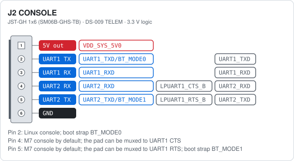
</picture>

Pins 2 to 5 follow the DS-009 TELEM layout for UART1: 2 = TX, 3 = RX, 4 = CTS, 5 = RTS. By default pin 4 carries UART2 RX and pin 5 UART2 TX (the M7 console). The same pads can be muxed to UART1 CTS and RTS instead, which gives UART1 full DS-009 flow control on this header. UART1 TX and UART2 TX are also the boot-mode straps BT_MODE0 and BT_MODE1. The same two UARTs are also on the USB console port J10 of the IO board, see the figure there.

> [!NOTE]
> UART1 TX and UART2 TX are boot straps. Keep them idle while the board resets, or it may boot from the wrong source.
<!-- /pinout -->

<!-- heading:main/J7 -->
### Main J7 DEBUG
<!-- /heading -->

<!-- pinout:main/J7 -->
<picture>
  <source media="(prefers-color-scheme: dark)" srcset="images/main-J7-dark.svg">
  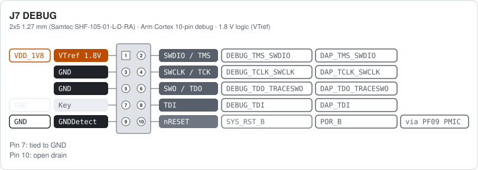
</picture>

Standard Arm Cortex 10-pin layout (0.05 inch). Works with J-Link, PyOCD, CMSIS-DAP and similar probes. nRESET goes through a diode to SYS_RST_B, so the probe can only pull it low.

> [!NOTE]
> VTref is 1.8 V. Use a debug probe that supports 1.8 V targets.
<!-- /pinout -->

<!-- heading:main/J1 -->
### Main J1 M.2 KEY M
<!-- /heading -->

<!-- pinout:main/J1 -->
<picture>
  <source media="(prefers-color-scheme: dark)" srcset="images/main-J1-dark.svg">
  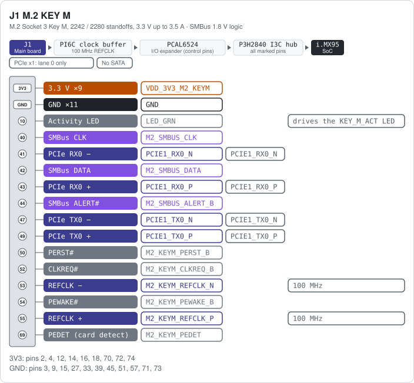
</picture>

Only the pins below are connected. All other pins of the 75-pin socket are not used: PCIe lanes 1 to 3 (odd pins 5 to 37), SATA, DEVSLP, SUSCLK (pin 68, link resistor not fitted), MFG1/2 and the even pins 6 to 36. The 3.3 V comes through an NX20P5090 load switch that the I/O expander can switch off: 3.5 A continuous, 7 A peaks of 100 µs.

> [!NOTE]
> PCIe x1 only, no SATA. An NVMe SSD or NPU module works; a SATA M.2 drive does not.
<!-- /pinout -->

<!-- heading:main/J16 -->
### Main J16 M.2 KEY B
<!-- /heading -->

<!-- pinout:main/J16 -->
<picture>
  <source media="(prefers-color-scheme: dark)" srcset="images/main-J16-dark.svg">
  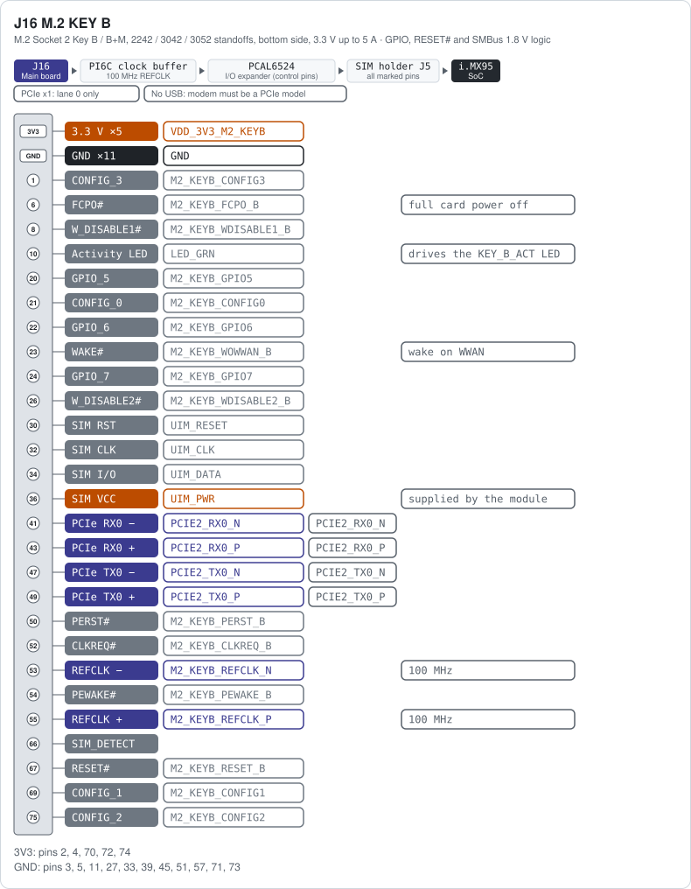
</picture>

Made for a PCIe cellular modem. The USB 2.0 pins (7, 9) and the USB 3.0 / lane 1 pins (29 to 37) are not connected. SMBus (40, 42, 44), SUSCLK (68) and the Bluetooth coexistence lines COEX1/2 (64, 62, to the IW612) are routed, but their link resistors are not fitted. ANTCTL0 to 3, COEX3, DPR, DEVSLP, GPIO_3/4/8 and MFG1/2 are not connected. The UIM pins go to the SIM holder J5. The 3.3 V comes through an NX20P5090 load switch that the I/O expander can switch off: 5 A continuous, 6 A peaks of 100 µs.

> [!IMPORTANT]
> Buying a 4G or 5G modem? Get one that runs over PCIe. This slot has no USB pins, so a USB modem stays silent. Many modems exist in a USB and a PCIe version with the same name: check the exact SKU or the manual.
<!-- /pinout -->

<!-- heading:main/J5 -->
### Main J5 SIM
<!-- /heading -->

<!-- pinout:main/J5 -->
<picture>
  <source media="(prefers-color-scheme: dark)" srcset="images/main-J5-dark.svg">
  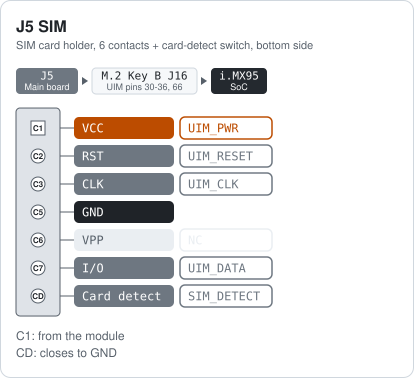
</picture>

Connected directly to the UIM pins of the Key B slot. The modem supplies the SIM voltage on UIM_PWR. The card-detect switch pulls SIM_DETECT low when a card is inserted. All contacts have ESD protection.
<!-- /pinout -->

<!-- heading:main/J11 -->
### Main J11 RTC_BAT
<!-- /heading -->

<!-- pinout:main/J11 -->
<picture>
  <source media="(prefers-color-scheme: dark)" srcset="images/main-J11-dark.svg">
  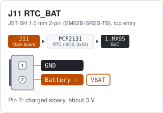
</picture>

Keeps the PCF2131 real-time clock running while the board has no power. The battery is charged slowly from the 3.3 V rail. This suits a rechargeable ML2020 cell such as the [RPi RTC Battery](https://www.raspberrypi.com/products/rtc-battery/).

> [!WARNING]
> Use a rechargeable ML2020 cell only. A CR2032 or other non-rechargeable cell must not be fitted: the board tries to charge it.
<!-- /pinout -->

<!-- others:main -->
### Main other connectors

| Ref | Function | Connector | Notes |
|---|---|---|---|
| J13 USB1 | USB 3.0 Type-C, serial download / device port | USB Type-C receptacle, bottom side | Serial-download port of the i.MX95 boot ROM and the port the NavQ95 flasher uses. USB 3.0 and USB 2.0 are both connected. |
| J12 USB2 | USB 2.0 Type-C host port | USB Type-C receptacle, bottom side | Host port. 5 V VBUS through an NX20P0477 load switch with over-current protection. |
| J8 ENET1 | Gigabit Ethernet with PTP | RJ45 with magnetics (Abracon ARJM11D7) | RTL8211 PHY on i.MX95 ENET1, supports IEEE 1588 PTP. |
| J6 MICROSD | microSD card slot (USDHC2) | microSD push-push, bottom side | USDHC2. The board can boot from it when the boot-mode switch selects SD. |
| J18 ANT0/ANT1 | Wi-Fi 6 / Bluetooth antennas (IW612), ANT0 = J18, ANT1 = J19 | 2x U.FL | ANT0 = J18, ANT1 = J19. IW612 Wi-Fi 6, Bluetooth and 802.15.4. |
| J3 B2B | Board-to-board expansion headers | Board-to-board headers | J3/J4 B2B_IO1/IO2 (2x25) for the IO board, J14/J15 B2B_CSI/DSICSI (2x20) for the camera boards, J17 B2B_ETH (2x25) for the T1 boards. Pin lists are on schematic page 25. |
<!-- /others -->

## IO expansion board

<!-- heading:io/J1 -->
### IO J1 CONSOLE
<!-- /heading -->

<!-- notes:io/J1 -->
A Silicon Labs CP2105 gives two serial ports on one USB-C connection. On a Linux host they appear as ttyUSB0 (UART1, Linux console) and ttyUSB1 (UART2, M7 console). RX and TX LEDs for both UARTs sit next to the connector. The same two UARTs also go to the J2 header on the main board, see the figure below.

> [!NOTE]
> Port 1 (ECI) is the Linux console, port 2 (SCI) is the M7 console. Do not let the host drive the TX lines while the board resets.
<!-- /notes -->

<!-- figure:console-shared -->
<picture>
  <source media="(prefers-color-scheme: dark)" srcset="images/figure-console-shared-dark.svg">
  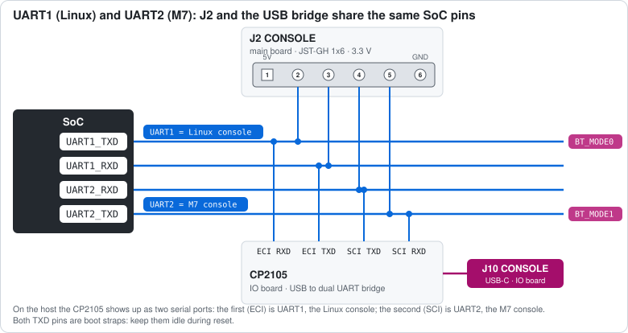
</picture>
<!-- /figure -->

<!-- heading:io/J6 -->
### IO J6 TELEM
<!-- /heading -->

<!-- pinout:io/J6 -->
<picture>
  <source media="(prefers-color-scheme: dark)" srcset="images/io-J6-dark.svg">
  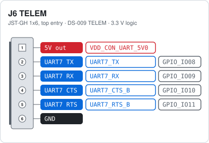
</picture>

The 5 V output is filtered (VDD_CON_UART_5V0) and has ESD protection.
<!-- /pinout -->

<!-- heading:io/J8 -->
### IO J8 GPS
<!-- /heading -->

<!-- pinout:io/J8 -->
<picture>
  <source media="(prefers-color-scheme: dark)" srcset="images/io-J8-dark.svg">
  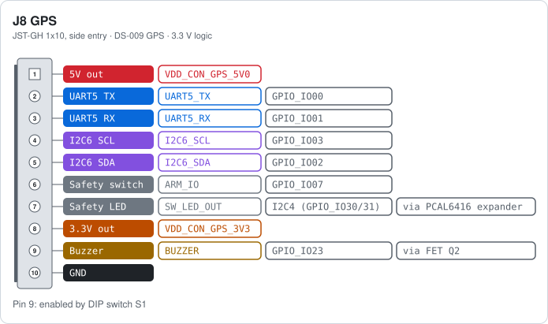
</picture>

Standard DS-009 GPS and compass connector. The safety switch input (ARM_IO) is also wired to the ARM button SW1 on the board, and the LED output drives the LED in the switch. The buzzer pin is switched by an N-FET (AO3400A) driven from TPM6_CH1. A buzzer on the board is connected in parallel. DIP switch S1 sits between TPM6_CH1 and the FET: with S1 OFF both buzzers are disconnected and TPM6_CH1 is free for PWM8 on the PWM header.
<!-- /pinout -->

<!-- heading:io/J7 -->
### IO J7 I2C
<!-- /heading -->

<!-- pinout:io/J7 -->
<picture>
  <source media="(prefers-color-scheme: dark)" srcset="images/io-J7-dark.svg">
  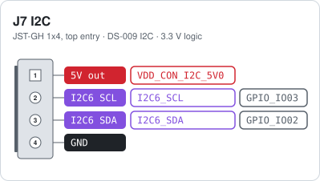
</picture>

Same I2C6 bus as the GPS connector.
<!-- /pinout -->

<!-- heading:io/J9 -->
### IO J9 PWM
<!-- /heading -->

<!-- pinout:io/J9 -->
<picture>
  <source media="(prefers-color-scheme: dark)" srcset="images/io-J9-dark.svg">
  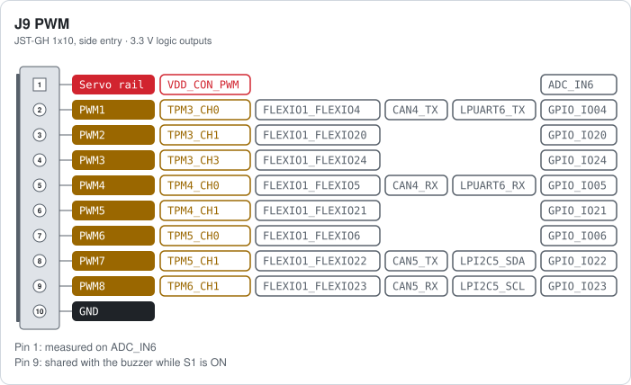
</picture>

Pin 1 (VDD_CON_PWM) is the servo power rail. It is linked to the board 5 V through R60 (0 Ω, not fitted) and measured on ADC_IN6 (VDD_CON_PWM / 8, up to 12 V). The outputs are 3.3 V logic with ESD protection. PWM8 (pin 9) also drives the buzzer. Every output pad can also be muxed to FlexIO1, for example for DShot or other custom timing protocols. Pins 2 and 5 can also be CAN4 or LPUART6 (TX and RX), pins 8 and 9 CAN5 or LPI2C5 (no pull-ups on the board). CAN4 and CAN5 need an external transceiver.

> [!WARNING]
> Do not put more than 5 V on the servo rail (pin 1) while R60 is fitted.

> [!TIP]
> Need all eight PWM outputs? Switch DIP switch S1 (BUZZER) off. It frees PWM8 from the buzzer.
<!-- /pinout -->

<!-- heading:io/J5 -->
### IO J5 CAN1
<!-- /heading -->

<!-- pinout:io/J5 -->
<picture>
  <source media="(prefers-color-scheme: dark)" srcset="images/io-J5-dark.svg">
  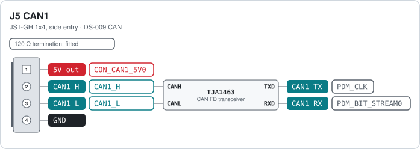
</picture>

TJA1463 CAN FD transceiver with 5 V supply. The 120 Ω split termination is on the board, so each CAN port is a bus end. CANH and CANL together form the differential bus. TXD and RXD are the logic pins of the transceiver and go to the FlexCAN pads of the i.MX95. The transceiver enable and standby pins are controlled through the PCAL6524 I/O expander.
<!-- /pinout -->

<!-- heading:io/J4 -->
### IO J4 CAN2
<!-- /heading -->

<!-- pinout:io/J4 -->
<picture>
  <source media="(prefers-color-scheme: dark)" srcset="images/io-J4-dark.svg">
  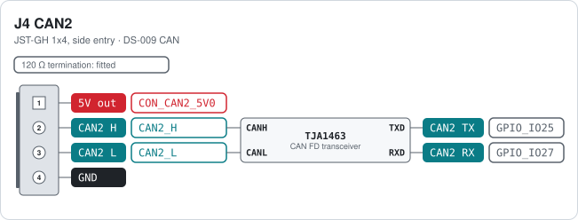
</picture>

Same circuit as CAN1, with the 120 Ω termination.
<!-- /pinout -->

<!-- heading:io/J3 -->
### IO J3 CAN3
<!-- /heading -->

<!-- pinout:io/J3 -->
<picture>
  <source media="(prefers-color-scheme: dark)" srcset="images/io-J3-dark.svg">
  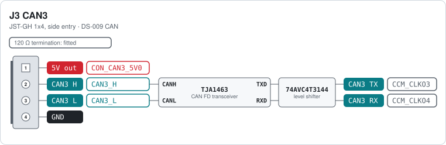
</picture>

Same circuit as CAN1, with the 120 Ω termination.
<!-- /pinout -->

<!-- heading:io/J12 -->
### IO J12 AUDIO
<!-- /heading -->

<!-- pinout:io/J12 -->
<picture>
  <source media="(prefers-color-scheme: dark)" srcset="images/io-J12-dark.svg">
  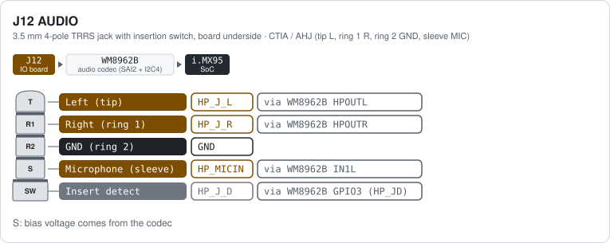
</picture>

Plug contacts listed from tip to sleeve. The switch in the jack drives HP_JD: high with a plug inserted, low without. The codec uses it to detect the plug. The headphone ground reference is the HP_FB sense line of the codec.

> [!NOTE]
> CTIA wiring only. OMTP headsets (microphone and ground swapped) do not work.
<!-- /pinout -->

<!-- heading:io/J2 -->
### IO J2 SPKR
<!-- /heading -->

<!-- pinout:io/J2 -->
<picture>
  <source media="(prefers-color-scheme: dark)" srcset="images/io-J2-dark.svg">
  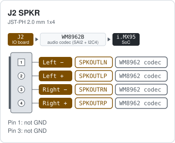
</picture>

Bridge-tied class-D outputs of the WM8962B codec. The 4-pin JST-PH plug of the [Adafruit 1669 Stereo Enclosed Speaker Set](https://www.adafruit.com/product/1669) (2x 3 W, 4 Ω) fits directly. J25 next to it is the headset jack; the board also has two PDM microphones.

> [!CAUTION]
> No GND on this connector. Each speaker goes between its − and + pin. Never connect a speaker pin to ground.
<!-- /pinout -->

<!-- others:io -->

<!-- /others -->

## Buttons and switches

<!-- switches -->
| Ref | Board | Function | Type | Notes |
|---|---|---|---|---|
| SW1 SYS_RST | Main | System reset button (short press: reset) | Tactile switch, right of the ON/OFF button, hidden under the thermal pad in the photo | Resets the whole board. |
| SW2 BTMODE | Main | Boot mode DIP switch | 4-position DIP switch, top side under the M.2 Key M module | See [Power up NavQ95](https://github.com/NXP-Robotics/imx-manifest-navq95#power-up-navq95). |
| SW3 ONOFF | Main | Power button (short press: on, 5 s press: off) | Tactile switch, left of the reset button | Talks to the PMIC ONOFF input. |
| S1 BUZZER | IO | Buzzer enable DIP switch | 1-position DIP switch (CHS-01TA1), next to the ARM button | ON connects TPM6_CH1 to the buzzer FET. OFF disconnects the buzzer and the GPS buzzer pin, so PWM8 on the PWM header is a free channel. |
| SW1 ARM | IO | Arm / safety switch with LED | Tactile switch | Wired in parallel with the safety-switch and LED pins of the GPS connector. |
| S1 SMI | T1S | SMI routing switch | 1-position DIP switch (CHS-01TA1) | Leave as delivered. Only used when the SJA1110 runs without the host. |
| S2 BOOT_OPT | T1S | SJA1110 boot option switch | 2-position DIP switch | Boot option of the SJA1110; see the SJA1110 documentation before changing it. |
<!-- /switches -->

## Camera expansion board

<!-- heading:cam/J3 -->
### CAM J3 CSI
<!-- /heading -->

<!-- pinout:cam/J3 -->
<picture>
  <source media="(prefers-color-scheme: dark)" srcset="images/cam-J3-dark.svg">
  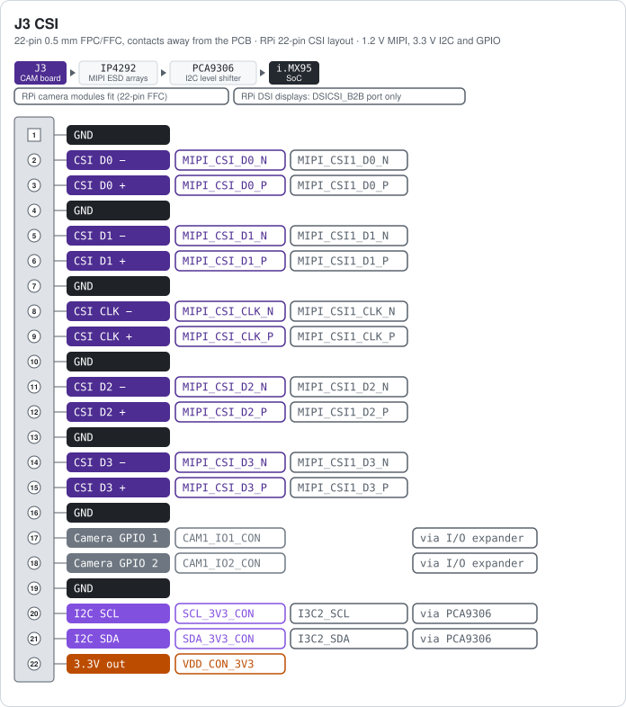
</picture>

Pin-compatible with the 22-pin RPi camera connector (22-pin 0.5 mm same-side FFC). Two identical camera boards can be fitted. In the bottom view, the left one sits on CSI_B2B and goes to the i.MX95 MIPI_CSI1 port; the right one sits on DSICSI_B2B and goes to the second port, which is shared between DSI and CSI. The camera I2C is the i.MX95 I3C2 bus, shifted from 1.8 V to 3.3 V by a PCA9306. The two GPIO pins come from the I/O expander on the main board; the exact expander pins and the pad names of the second port were not traced. Whether a camera module works depends on the software image, not on the connector. J4 next to it is a 3-pin 5 V header for a display, not fitted.

> [!TIP]
> RPi camera modules fit directly with a standard 22-pin FFC. For an RPi DSI display use the camera board on the DSICSI_B2B port; the CSI_B2B port cannot drive a display.
<!-- /pinout -->

<!-- heading:cam/J4 -->
### CAM J4 5V
<!-- /heading -->

<!-- pinout:cam/J4 -->
<picture>
  <source media="(prefers-color-scheme: dark)" srcset="images/cam-J4-dark.svg">
  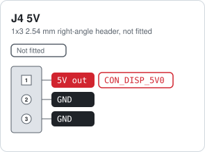
</picture>

Filtered 5 V from the system rail with ESD protection, meant for a DSI display on the DSICSI_B2B camera board. The silkscreen marks pin 1 as 5V.
<!-- /pinout -->

## T1 Ethernet switch board

The MR-NAVQ95E-T1S board is an NXP SJA1110 automotive Ethernet switch. It is connected to the
main board through B2B_ETH on SGMII port 4 of the switch (the host port). Ports 1 and 2 are
1000BASE-T1 through two TJA1120 PHYs on SGMII ports 1 and 2. Ports 5 to 10 are 100BASE-T1 on
the switch's own PHYs. SGMII port 3 is not used. The port numbers on the bottom view are the
switch port numbers, which also match the silkscreen.

<!-- others:t1s -->
### T1S ports and headers

| Ref | Function | Connector | Notes |
|---|---|---|---|
| J4 PORT1 | 1000BASE-T1 port 1 | Single-pair automotive connector | TJA1120 PHY on SJA1110 SGMII port 1. |
| J3 PORT2 | 1000BASE-T1 port 2 | Single-pair automotive connector | TJA1120 PHY on SJA1110 SGMII port 2. |
| J5 PORT5 | 100BASE-T1 port 5 | 2-pin single-pair connector | SJA1110 internal 100BASE-T1 PHY, switch port 5. |
| J6 PORT6 | 100BASE-T1 port 6 | 2-pin single-pair connector | SJA1110 internal 100BASE-T1 PHY, switch port 6. |
| J7 PORT7 | 100BASE-T1 port 7 | 2-pin single-pair connector | SJA1110 internal 100BASE-T1 PHY, switch port 7. |
| J8 PORT8 | 100BASE-T1 port 8 | 2-pin single-pair connector | SJA1110 internal 100BASE-T1 PHY, switch port 8. |
| J9 PORT9 | 100BASE-T1 port 9 | 2-pin single-pair connector | SJA1110 internal 100BASE-T1 PHY, switch port 9. |
| J10 PORT10 | 100BASE-T1 port 10 | 2-pin single-pair connector | SJA1110 internal 100BASE-T1 PHY, switch port 10. |
| J2 DEBUG | Debug header of the SJA1110 (Arm Cortex-M7 inside the switch) | 2x5 1.27 mm | Not the i.MX95 debug port; that is J7 on the main board. |
<!-- /others -->

## Notes

- The connectors marked DS-009 on their card (TELEM, GPS, I2C, CAN and the J2 console header)
  follow the Dronecode
  [DS-009 connector standard](https://github.com/pixhawk/Pixhawk-Standards/blob/master/DS-009%20Pixhawk%20Connector%20Standard.pdf),
  so standard cables fit. The other JST-GH connectors, such as the PWM header, have their own pin order.
- Input 9 to 52 V (never more than 60 V), 3S to 12S batteries. 60 W between 9 and 20 V, 125 W between 20 and 52 V.
- The 5 V pin of every JST-GH connector is a filtered, ESD-protected output of the 5 V system rail
  (`VDD_CON_*_5V0` nets).
- The servo rail of the PWM connector (`VDD_CON_PWM`) is separated from the 5 V rail by R60, a
  0 Ω link that is not fitted. This allows an external servo supply. The rail is measured on ADC_IN6
  and must stay below 12 V.
- VIN, 5 V and 3.3 V are measured on ADC_IN0, ADC_IN1 and ADC_IN2.

> [!WARNING]
> Never feed power into a 5 V pin of a JST-GH connector. They are outputs. Power the board through J9 PWR_IN only.

## Downloads

This reference as an [A4 PDF](MR-NAVQ95-hardware-reference.pdf), and all cards on one
double-sided A4 landscape sheet: [cheat sheet PDF](MR-NAVQ95-cheatsheet.pdf).

Note: NXP and the NXP logo are registered trademarks of NXP B.V.
